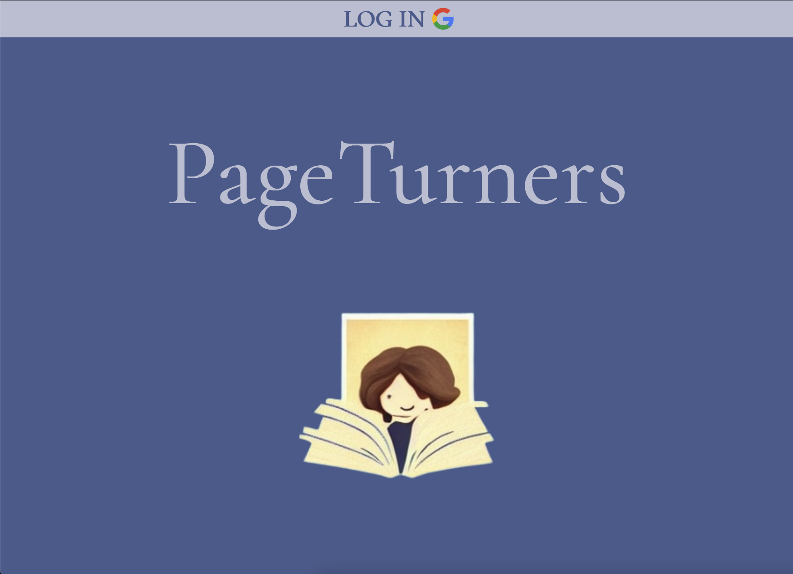
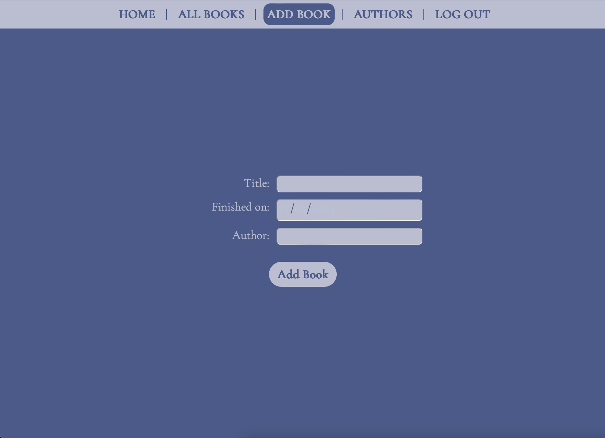
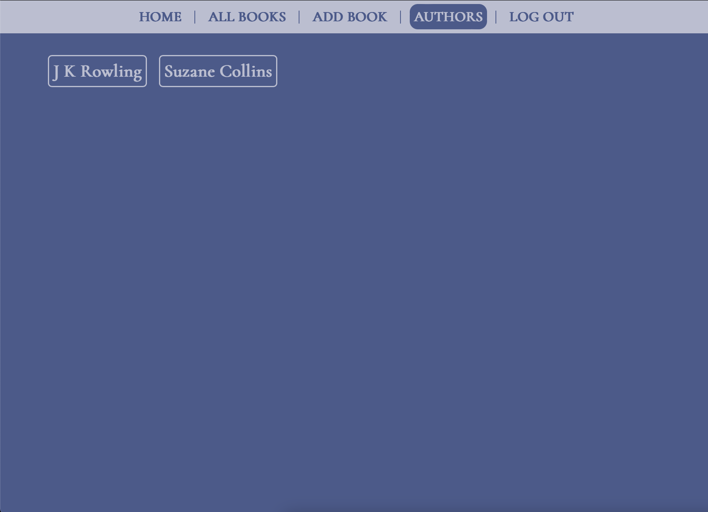
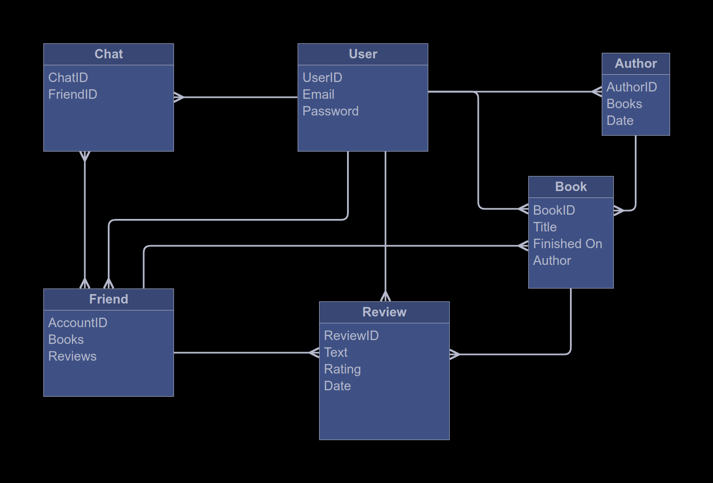
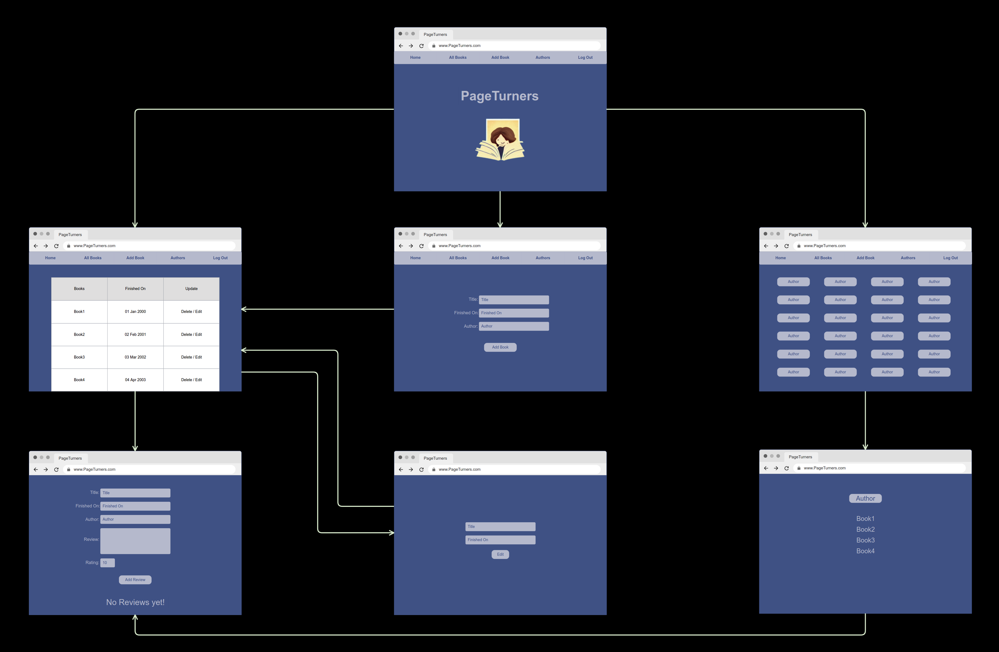
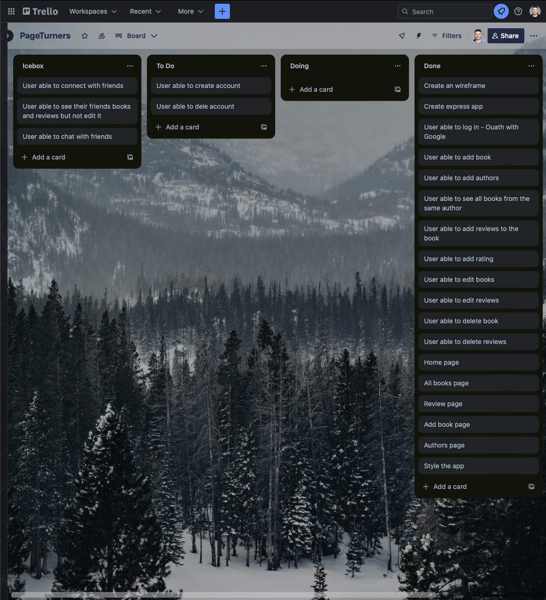

# PageTurnes

## Link to App
https://josehneves.github.io/PageTurners/

## Descripiton
PageTurners is an online platform that brings book tracking to a virtual book club space. It's designed to help avid readers keep track of the books they've read and share their thoughts through reviews.

## App Gallery

## Technologies
- Express
- Node.js
- MongoDB
- Mongoose
- HTML
- CSS
- JavaScript
- Heroku

## ERD and Wireframe

## Trello Board

## Future Enhancements
Create an option where the users can add friends to their accounts and be able to see the book they have read, and what they thought about it.
After the option to add friends, implement a chat function where users can send private messages or in a group chat about their favorite books. Then, users can also borrow books from each other.

## Author
www.linkedin.com/in/jose-henrique-neves

## License
Copyright (c) 2023 Jose Henrique Neves

Permission is hereby granted, free of charge, to any person obtaining
a copy of this software and associated documentation files (the
"Software"), to deal in the Software without restriction, including
without limitation the rights to use, copy, modify, merge, publish,
distribute, sublicense, and/or sell copies of the Software, and to
permit persons to whom the Software is furnished to do so, subject to
the following conditions:

The above copyright notice and this permission notice shall be
included in all copies or substantial portions of the Software.

THE SOFTWARE IS PROVIDED "AS IS", WITHOUT WARRANTY OF ANY KIND,
EXPRESS OR IMPLIED, INCLUDING BUT NOT LIMITED TO THE WARRANTIES OF
MERCHANTABILITY, FITNESS FOR A PARTICULAR PURPOSE AND
NONINFRINGEMENT. IN NO EVENT SHALL THE AUTHORS OR COPYRIGHT HOLDERS BE
LIABLE FOR ANY CLAIM, DAMAGES OR OTHER LIABILITY, WHETHER IN AN ACTION
OF CONTRACT, TORT OR OTHERWISE, ARISING FROM, OUT OF OR IN CONNECTION
WITH THE SOFTWARE OR THE USE OR OTHER DEALINGS IN THE SOFTWARE.
